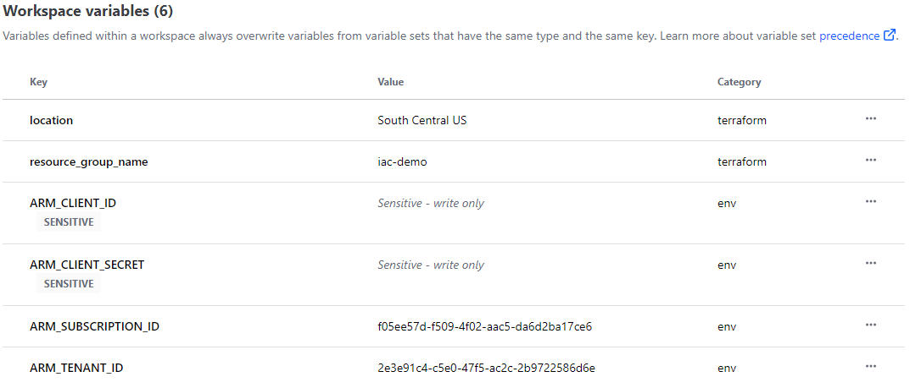
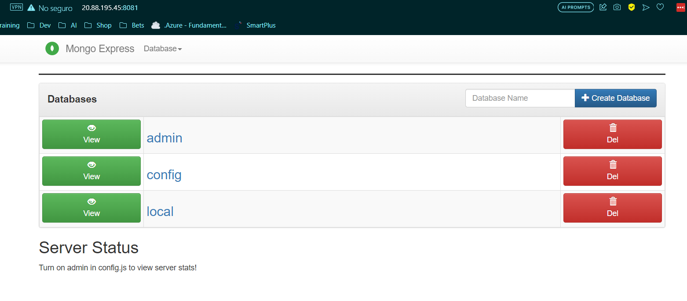

# Azure Infrastructure

## Prerequisites
- [Terraform](https://www.terraform.io/downloads) >= 1.5 (see `.tf` files for version compatibility)
- [Azure CLI](https://learn.microsoft.com/en-us/cli/azure/install-azure-cli)
- An existing App Registration or Service Principal configured in the target subscription to deploy into, with appropriate permissions and access control set up ([instructions here](https://dev.to/this-is-learning/deploy-azure-infrastructure-using-terraform-cloud-3j9d))
or check terraform [azurerm doc](https://registry.terraform.io/providers/hashicorp/azurerm/latest/docs)

## Backend

Backend can be stored in an azure storage and secured with vault
more info can be found [here](https://learn.microsoft.com/en-us/azure/developer/terraform/store-state-in-azure-storage?tabs=azure-cli)

`example `
```terraform
backend "azurerm" {
    resource_group_name  = "tfstate"
    storage_account_name = "tfstateahn98"
    container_name       = "tfstate"
    key                  = "terraform.tfstate"
}
```

For this project state will ba stored in [Terraform Cloud](https://app.terraform.io/app)

`example`
```terraform
backend "remote" {
    hostname     = "app.terraform.io"
    organization = "angel-nav"
    workspaces {
      name = "iac-demo"
    }
  }
```
## Steps

1. Run `az login` and log in to your azure account in browser
```json
{
  "environmentName": "AzureCloud",
  "homeTenantId": "xxxx-xxxx-xxxx-xxxx-xxxxxxxx",
  "id": "xxxxxxxxx-xxxx-xxxx-xxxx-xxxxxxxx",
  "isDefault": true,
  "managedByTenants": [],
  "name": "Azure subscription 1",
  "state": "Enabled",
  "tenantId": "xxxx-xxxx-xxxx-xxxx-xxxxxxxx",
  "user": {
    "name": "angel98_nava@hotmail.com",
    "type": "user"
  }
}
```

2. Configure _Wrokspace variables_ in Terraform Cloud plattform.
[more variables options](https://registry.terraform.io/providers/hashicorp/azurerm/latest/docs)



3. Run `terraform init` to initialize current working directory then `terraform plan`
    
    - Once you're sure the infrastructure contains everything well configured, we can execute `terraform apply`

4. Deploy apps into Azure Kubernetes Cluster
   
    - On the terminal, run the following command in order to connect to your Kubernetes Cluster, make sure to type your `resource group` and your `kluster name`:

      ```
      az aks get-credentials --resource-group iac-demo --name iac-demo-aks
      ```
  
    ### Packaging our k8s cluster using Helm

      - **Installing helm**
        follow the instructions [here](https://helm.sh/es/docs/intro/quickstart/)


      - **Installing helmify**
        
        Helmify reads a list of supported k8s objects from stdin and converts it to a helm chart. Designed to generate charts for k8s operators but not limited to. See installation [here](https://github.com/arttor/helmify)

        Once you run helmify, Chart files will be created
        ```bash 
        helmify -f /mongo-app-deployment mongo-app-chart
        ```

        ```
        $ ls mongo-app-chart/
        Chart.yaml  templates/  values.yaml
        ```

        helmify is not perfect. You need to check all values and configuration were created correctly

        

      - Running Helm

        ```bash 
        $ helm install release .
          NAME: release
          LAST DEPLOYED: Mon Sep 25 10:40:02 2023
          NAMESPACE: default
          STATUS: deployed
          REVISION: 1
          TEST SUITE: None
        ```


      - Then we check all is released into our AKS

        

      - Our application will be available on ``http://20.88.195.45:8081`` that is the ``EXTERNAL-IP`` of the Load Balancer

        


**Done!** we released an app into an AKS

- To delete all run

```bash 
$ helm uninstall release
release "release" uninstalled
```

Also don't forget to delete terraform resources using ``terraform destroy``